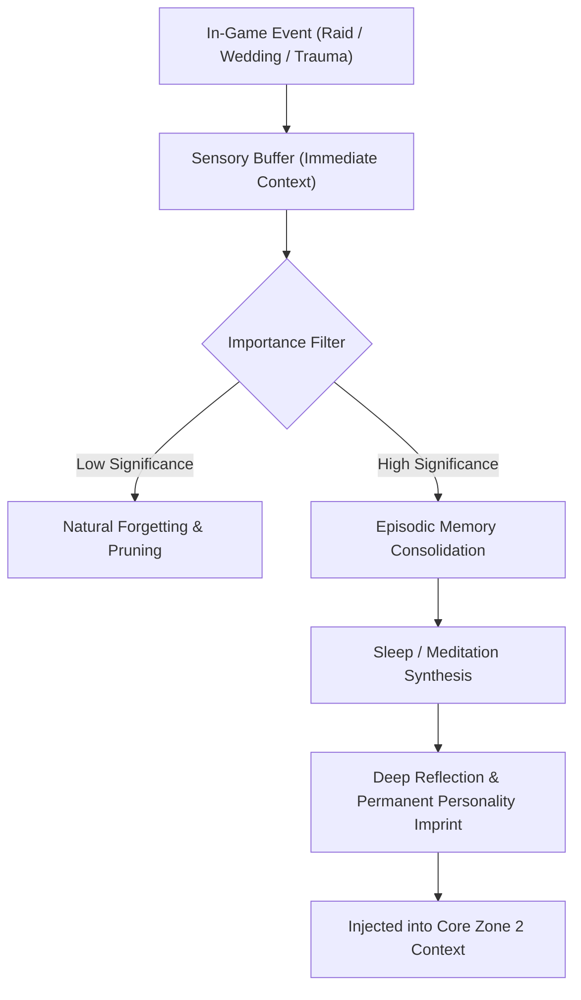

<div align="center">

# RimMind-Memory 🧠
### 3-Tier Cognitive Memory Hierarchy & Temporal Context Engine for RimWorld 1.6

**English** | [简体中文](README_zh.md)

<p>
  <a href="https://rimworldgame.com/"></a>
  <a href="https://github.com/mcocdaa/RimWorld-RimMind-Mod-Core"></a>
  <a href="#"></a>
  <a href="LICENSE"></a>
</p>

<p><em>Endow colonists with long-term memory, episodic life chronicles, and natural emotional decay.</em></p>

</div>

---

## 📖 Overview

**RimMind-Memory** implements a biologically inspired, multi-tiered cognitive memory system for RimWorld. Rather than overwhelming LLM prompts with unfiltered event dumps, memories are structured, filtered, and consolidated across distinct cognitive layers.

### 3-Tier Architecture
1. **Sensory & Working Buffer (L1)**: Captures immediate environmental sensations and short-lived interactions. Automatically decays after several hours.
2. **Episodic Daily Chronicle (L2)**: Records daily milestones, battle triumphs, tragic losses, and relationship shifts in concise narrative entries.
3. **Reflective & Dark Memories (L3)**: Enduring convictions, traumas, and life philosophy shaped by major colony events (e.g., witnessing cannibalism, surviving a betrayal, or falling in love).

---

## 🎮 In-Game Showcase


*Memory inspection window: Viewing a colonist's multi-layered memory chronicle, showing decayed sensory impressions alongside pinned life milestones.*

---

## 🏛️ Memory Lifecycle & Decay Flow



---

## 🛠️ Installation & Load Order

```text
1. Harmony
2. Core (Vanilla RimWorld)
3. RimMind-Core
4. RimMind-Memory
```

---

## 🧪 Developer Guide & Testing

Run unit tests directly:

```powershell
dotnet test RimMind-Memory/Tests/RimMindMemory.Tests.csproj -c Release
```

---

## 📜 License

Licensed under the [MIT License](LICENSE).
