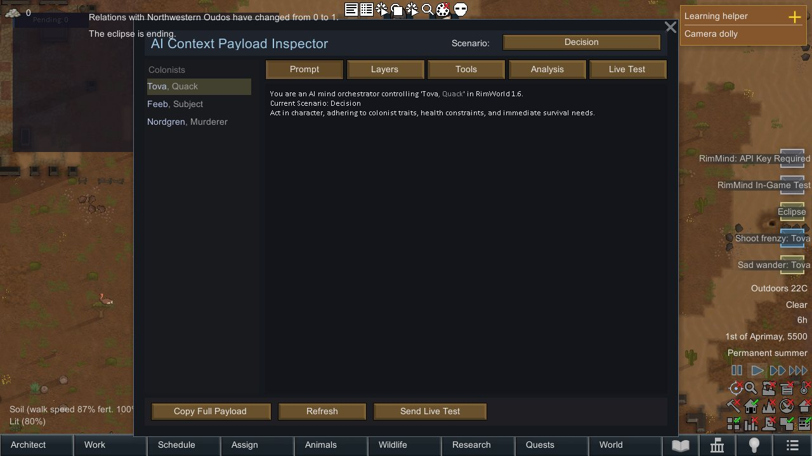
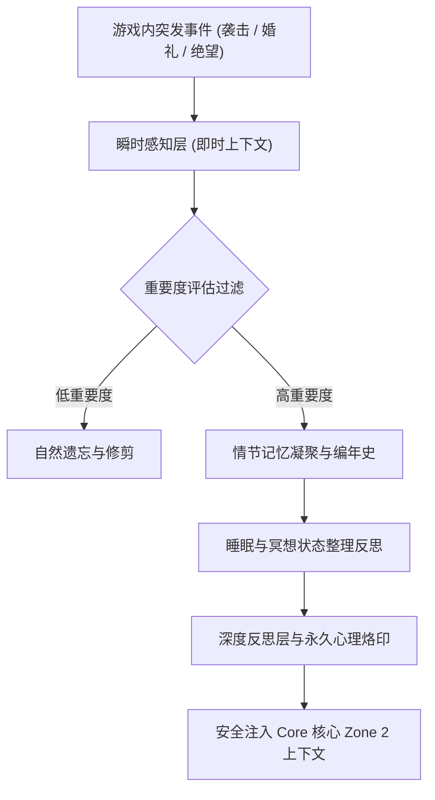

<div align="center">

# RimMind-Memory 🧠
### 专为 RimWorld 1.6 打造的三层认知记忆、情绪衰减与史诗编年史系统

[English](README.md) | **简体中文**

<p>
  <a href="https://rimworldgame.com/"></a>
  <a href="https://github.com/mcocdaa/RimWorld-RimMind-Mod-Core"></a>
  <a href="#"></a>
  <a href="LICENSE"></a>
</p>

<p><em>为殖民者赋予长效记忆、跌宕起伏的生命编年史与自然的情绪遗忘曲线。</em></p>

</div>

---

## 📖 模块概览

**RimMind-Memory** 为 RimWorld 引入了受生物认知心理学启发的三层记忆体系。它拒绝将未经清洗的事件全量丢给大模型，而是通过分层聚合、自然遗忘衰减与重点固定，让小人的记忆既丰富又高效。

### 三层认知架构
1. **感知与工作记忆 (L1)**：捕获当下的即时感知与琐碎交流，随时间推移数小时内平滑衰减。
2. **情节记忆编年史 (L2)**：记录战役胜利、惨痛牺牲、重要婚礼等关键里程碑，以简明摘要方式沉淀。
3. **反思与暗记忆 (L3)**：重大人生挫折（目睹同类相食、遭遇背叛、痛失挚友）形成的根深蒂固信念与人生哲学，永久性重塑其心理防御机制。

---

## 🎮 实机特性展示


*记忆报文检视器界面：直观展示殖民者的感知记忆、情节纪事与深层暗记忆，支持按时间衰减与重点固定。*

---

## 🏛️ 记忆生命周期流转



---

## 🛠️ 安装与加载顺序

```text
1. Harmony
2. Core (RimWorld 原版)
3. RimMind-Core
4. RimMind-Memory
```

---

## 🧪 开发者测试指南

运行单元测试：

```powershell
dotnet test RimMind-Memory/Tests/RimMindMemory.Tests.csproj -c Release
```

---

## 📜 开源协议

本项目采用 [MIT License](LICENSE) 开源许可证。
